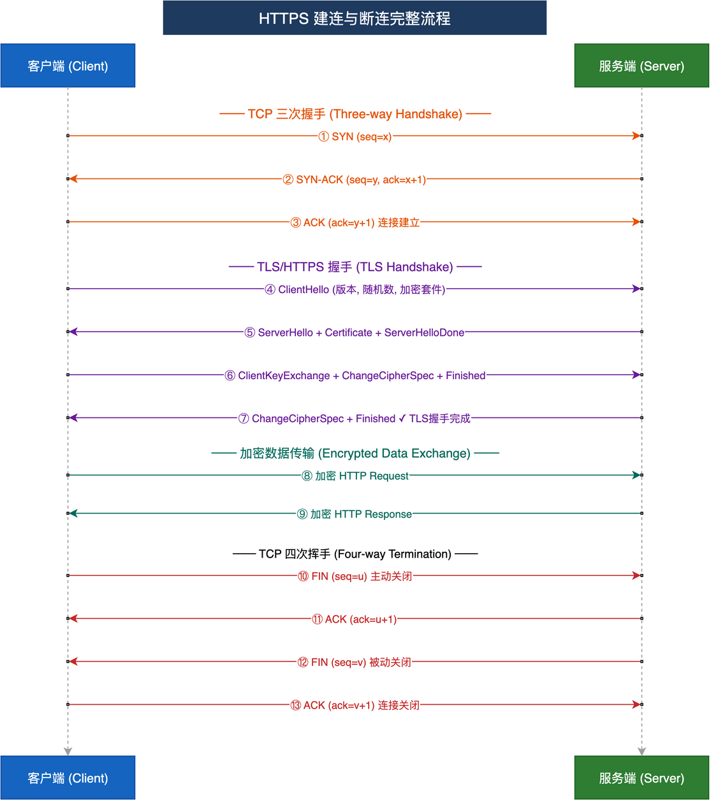
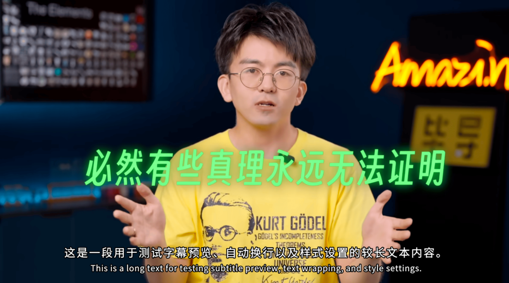

# CLI-Anything Demo Assets

This directory centralizes the GIFs and images used by the repository demo pages.
The top-level [README.md](../README.md) is the primary showcase; this file is the
asset-side landing page so the directory still makes sense on its own.

---

## FreeCAD — Curiosity Rover via Preview, Live Preview, and Trajectory

> **Harness:** `cli-anything-freecad` | **Preview Stack:** `preview` + `preview live` + `trajectory.json` | **Artifact:** Agent-built Curiosity-style rover

An agent incrementally assembles a Curiosity-inspired rover while publishing real
FreeCAD preview bundles, refreshing a live preview session, and recording
command-to-preview history for later replay.

  

  README GIF generated from the full local demo video with a speed-adjusted, high-quality ffmpeg palette workflow.

---

## Blender — Orbital Relay Drone via Preview, Live Preview, and Trajectory

> **Harness:** `cli-anything-blender` | **Preview Stack:** `preview` + `preview live` + `trajectory.json` | **Artifact:** Agent-built orbital relay drone

An agent uses the Blender harness to grow a hard-surface orbital relay drone under
a real preview loop: each stage pushes new render-backed bundles, the live
session tracks the current head, and the trajectory ties every command to the
matching visual state.

  

  README GIF generated from the full local demo video with a speed-adjusted, high-quality ffmpeg palette workflow.

---

## Draw.io — HTTPS Handshake Diagram

> **Harness:** `cli-anything-drawio` | **Time:** ~4 min | **Artifact:** `.drawio` + `.png`

An agent creates a full HTTPS connection lifecycle diagram from scratch through
CLI commands only.

  

Final artifact

  

*Contributed by [@zhangxilong-43](https://github.com/zhangxilong-43)*

---

## Slay the Spire II — Game Automation

> **Harness:** `cli-anything-slay-the-spire-ii` | **Artifact:** Automated gameplay session

An agent plays through a Slay the Spire II run using the CLI harness, making
real-time strategic decisions from game state.

  

*Contributed by [@TianyuFan0504](https://github.com/TianyuFan0504)*

---

## VideoCaptioner — Auto-Generated Subtitles

> **Harness:** `cli-anything-videocaptioner` | **Artifact:** Captioned video frames

An agent uses the VideoCaptioner CLI to automatically generate and overlay styled
subtitles onto video content.

<table align="center">
<tr>
<td align="center"><strong>Sub A</strong></td>
<td align="center"><strong>Sub B</strong></td>
</tr>
<tr>
<td></td>
<td></td>
</tr>
</table>

*Contributed by [@WEIFENG2333](https://github.com/WEIFENG2333)*
