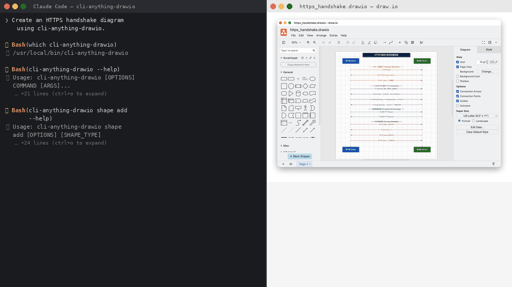
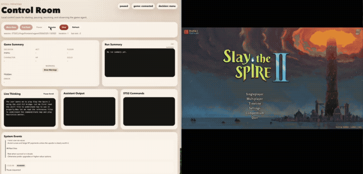
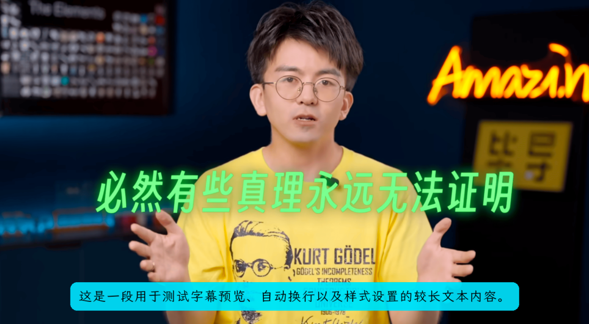

# CLI-Anything Examples

Real-world demonstrations of CLI-Anything harnesses in action. Each example shows an AI agent (Claude Code) using a generated CLI to produce a complete, useful artifact — no GUI needed.

---

## Draw.io &mdash; HTTPS Handshake Diagram

> **Harness:** `cli-anything-drawio` | **Time:** ~4 min | **Artifact:** `.drawio` + `.png`

An agent creates a full HTTPS connection lifecycle diagram from scratch — TCP three-way handshake, TLS negotiation, encrypted data exchange, and TCP four-way termination — entirely through CLI commands.

  

Final artifact

  

**What it demonstrates:**
- Creating shapes (rectangles, labels) with precise positioning
- Adding styled connectors (arrows with colors, labels, dashed lines)
- Section-based layout with color-coded phases (orange/purple/teal/red)
- Exporting to PNG via the Draw.io backend

*Contributed by [@zhangxilong-43](https://github.com/zhangxilong-43)*

---

## Slay the Spire II &mdash; Game Automation

> **Harness:** `cli-anything-slay-the-spire-ii` | **Artifact:** Automated gameplay session

An agent plays through a Slay the Spire II run using the CLI harness — reading game state, selecting cards, choosing paths, and making strategic decisions in real-time.

  

**What it demonstrates:**
- Real-time game state reading and decision making
- Complex multi-step strategy execution
- Agent-driven interaction with a live application

*Contributed by [@TianyuFan0504](https://github.com/TianyuFan0504)*

---

## VideoCaptioner &mdash; Auto-Generated Subtitles

> **Harness:** `cli-anything-videocaptioner` | **Artifact:** Captioned video frames

An agent uses the VideoCaptioner CLI to automatically generate and overlay styled subtitles onto video content, with bilingual text rendering and customizable formatting.

<table align="center">
<tr>
<td align="center"><strong>Sub A</strong></td>
<td align="center"><strong>Sub B</strong></td>
</tr>
<tr>
<td></td>
<td></td>
</tr>
</table>

**What it demonstrates:**
- Automatic speech-to-text subtitle generation
- Bilingual caption overlay (Chinese + English)
- Styled text rendering with custom formatting and positioning

*Contributed by [@WEIFENG2333](https://github.com/WEIFENG2333)*

---

## More CLI Demos Coming Soon
